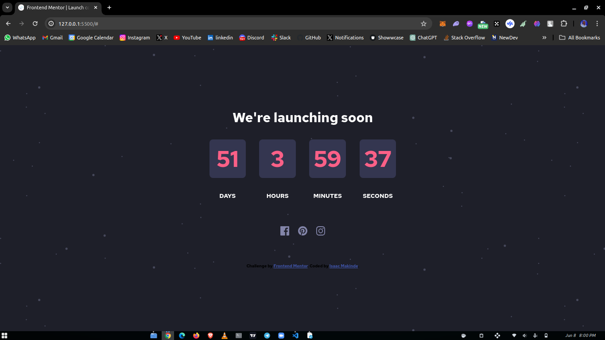

# Frontend Mentor - Launch countdown timer solution

This is a solution to the [Launch countdown timer challenge on Frontend Mentor](https://www.frontendmentor.io/challenges/launch-countdown-timer-N0XkGfyz-). Frontend Mentor challenges help you improve your coding skills by building realistic projects.

## Table of contents

- [Screenshot](#screenshot)
- [Links](#links)
- [Built with](#built-with)
- [Author](#author)

### Screenshot

### Links

- Solution URL: [Solution](https://github.com/Oluwa-Laughter/launch-countdown-timer)
- Live Site URL: [Live](https://oluwa-laughter.github.io/launch-countdown-timer/)

### Built with

- Semantic HTML5 markup
- CSS custom properties
- Flexbox
- CSS Grid
- Vanilla JavaScript

## Author

- Website - [Isaac Makinde](https://github.com/Oluwa-Laughter)
- Frontend Mentor - [Oluwa-Laughter](https://www.frontendmentor.io/profile/Oluwa-Laughter)
- Twitter - [LAUGHTER](https://www.twitter.com/isaacmakinde_)
- LinkedIn - [Isaac Makinde](https://www.linkedin.com/in/isaacmakinde/)
